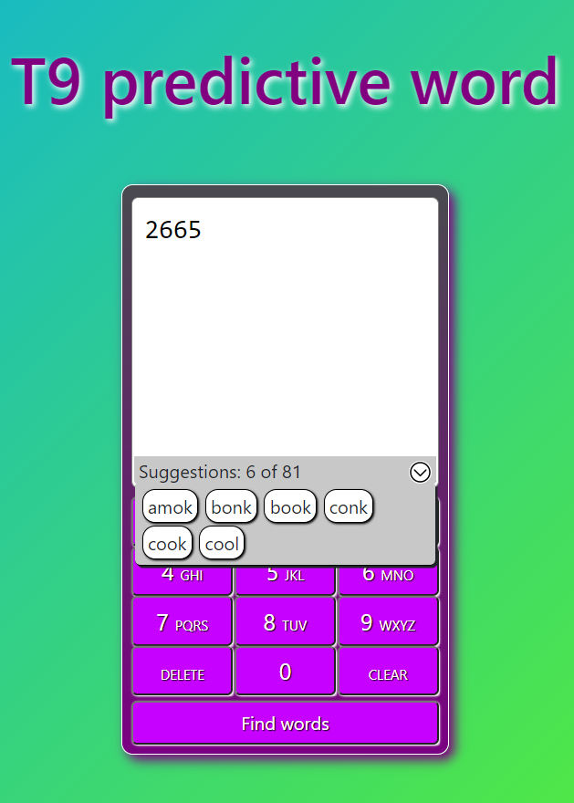

# T9 Phoneword full stack application

Application build to predict word from numbers (known as phoneword) - built with React(Frontend) and NodeJS(Backend)




## Description

This application converts valid number used to generate some [phonewords](https://en.wikipedia.org/wiki/Phoneword). Input desired code and it will output all possible real words in english.

The frontend has validation, checking that the phone numbers are only integers (2-9) digits , is not empty, and shows all the corresponding  real phone words in a list that also checks if there are no words matching or something went wrong with the request. Interface does not have restriction with maximum length, but more numbers you enter, more time it takes to calculate output.

The backend is a documented, tested **API developed with NodeJS** that exposes an endpoint that given a number returns all the real phonewords for that number, it checks for valid numbers and possible errors.

## Application setup

Clone project

```
git clone https://github.com/kovar95/T9Project.git
```

To install all dependencies run in root folder

```
npm install
```

Then go to `/client`, and again run

```
npm install
```

To run on your local machine,  simply execute from root folder:

```
npm run start
```

It will concurrently run both backend and frontend.

The **Front End** will be available at `localhost:3000`, and the **Backend** API, at `localhost:5000`

## Frontend

The Frontend uses:

- React
- Redux
- PropTypes checking
- Sass styling

To start only frontend, just run in `/client`:

```
npm run start
```

the application will be available at port `3000` on `localhost`.

to build run 
```
npm run build
```

## NodeJS Backend

The NodeJS Backend uses

- Node
- ExpressJS
- Mocha + Chai

Your API is running at `localhost:5000`. You can access it via `/api/phonewords/` 


Start the API by running

```
npm run server
```

To test just run

```
npm run test
```